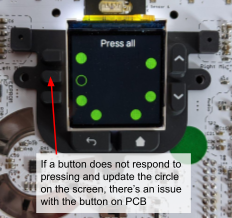

# Ubo Hardware Acceptance Tests
This repo constrains test scripts for hardware acceptance tests that are performed during manufacturing by the factory. 

Note: The test results get uploaded to S3 bucket at the end, but due to security reasons AWS keys have been removed from this script. If you wish to have the test resultuploaded to your own S3 service, replace keys with valid keys.

## Setup

Update your system and clone this repository 

```
sudo apt update  
sudo apt upgrade  
git clone https://github.com/ubopod/ubo-hw-acceptance.git
```

rename working directory

`mv ./ubo-hw-acceptance /home/pi/ubo`

If you end up using a different directory name or location, make sure you change the first line in `install.sh` script to reflact that:

`UBO_HOME=/home/pi/ubo` in `setup/install.sh` 

## Install

Run install script to setup everything

```
cd setup/  
bash install.sh
```

## Reboot
`sudo reboot`

## Run

Please note that the setup script already creates a bootup service called `hardware-test` that runs the test automatically after you reboot the Pi. If you wish to run the test manually, disable this sevice first, by running 

`sudo systemctl stop hardware-test` (or to disable run: `sudo systemctl disable hardware-test`)

Then, go to `cd test/hw_acceptance` and run `bash test.sh`.

The video shows the end-to-end test procedure:

[](https://www.youtube.com/watch?v=X0lBcDt_kOM "Test procedure")


# What does the test script do?

The main script `test.sh` runs a suite of individual tests which are managed by seperate python scripts that function as standalone tests. The python scripts can be excecuted seperately to test only a certain functions. In the following section, we provide a brief overview of each test step, its purpos, and things to looh out for.

## Testing EEPROM ROM

When the test starts, it first run `tests/hw_acceptance/test_eeprom.py` script that tests the EEPROM and write some initializtion data on it. To test the EEPROM, it first checks it the device is detected on the correct I2C bus address. Then, it reads the content to see if the EEPROM has been tested before and contains valid information. If so, it terminates the process and the scripts proceeds to next step. 

If the EEPROM does not contain recognizable information and it has not been programmed previously, it writes all zeros to the memory (erases the content) and reads back the content to make sure it is all zero.

Valid EEPROM entry must contain non-zero `product_uuid`, and `serial_number` in the custom binary data (json-formatted).


```
# Vendor info
# 128 bit UUID. If left at zero eepmake tool will auto-generate
# RFC 4122 compliant UUID

product_uuid 12345678-1234-1234-1234-012345678910 #MUST BE NON ZERO

# 16 bit product id
product_id 0x0105

# 16 bit product version
product_ver 0x0001

# ASCII vendor string  (max 255 characters)
vendor "Ubo Technology Company"

# ASCII product string (max 255 characters)
product "Ubo HAT"

# Custom binary data
SOMECUSTOMINFORMATIONHERE
```
For more information, checkout EEPROM repo here.

If the EEPROM does not contain valid and recognable information, the script writes test result data, as well as a randomly generated serial number that would be unqiue to each HAT. If it already contains a valid serial number, the test would not write new information on it. It just reads the serial number for updating subsequenct test results. 

## Scanning for I2C devices
After EEPROM test is performed, the bash script runs `tests/hw_acceptance/scan_i2c.py` file that scans for devices detected on the I2C bus and compares the detected addresses with expected device addresses. If there's any discrepency or some device does not appear on the bus, the test would fail. 

We also use this test to detect the device "trim". For example, if the scan only finds keypad IC, then we are dealing with a minimum SKU build and if it finds keypad IC, temperature sensor IC, light sensor IC, and audio IC, then the device under test is a full SKU build. 

The following lists shows the addresses for each device connected to the bus.

```
keypad IC address: 0x58
temperature sensor address: 0x48
ambient light sensor address: 0x10 
audio (control) IC address: 0x1a
```

## Testing LCD

Next, the test script proceeds to run `tests/hw_acceptance/test_lcd.py` to test the LCD display. It tests the capability to display colors and patterns. The test operaor must use the keypad to confirm (yes/no) seeing displayed color and pattern. If operator cannot see the displayed patterns/colors correctly, then the test would fail. The test result will be captured in the `serial_number.json` file.

## Testing Keypad

The next test verifies buttons on the keypad operate correctly by running the `tests/hw_acceptance/test_buttons.py`. It shows a pattern on screen and asks the test operator to press all buttons, and verify all of them are working correctly (see picture below). The test won't proceed if there's an issue with any of the buttons on the keypad. (TODO: Better behavior would be to time out if no button is press for some time since the last button press.)


  


## Testing LED Ring

Next, the script will attempt to test the LED light ring located around the circumference of the PCB. The program `tests/hw_acceptance/test_lcd.py`  lights up all the LEDs fully with red, green, and blue colors and will ask the operator to confirm if the ring is lit up completely with correct colors.


If the LED test fails (for example, the ring does not light up at all or only lights up partially and not entirely), the operator must take note of the LED index that is not lighting up (index is written on the PCB silkscreen layer next to the LED, for example LED 20 in picture below), and follow repair instructions.


## Testing Light Sensor
## Testing Temperature Sensor
## Testing Speakers
## Testing Microphones
## Testing IR Transmitter and Receiver
## Writing test results on EEPRON
## Uploading test results to S3
## Priting QA Label with serial number


